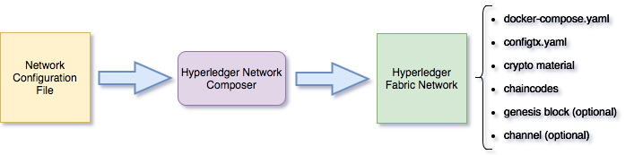

# Fabric Network Composer

Fabric Network Composer automates the generation of an operational Hyperledger Fabric Network based on a configuration file where basic aspects of the network are defined in a simple way.

This simple tool is useful when getting started with Hyperledger Fabric and for bootstrapping development/testing Hyperledger Fabric Networks based on customized Hyperledger Fabric images.



### Configuration file

The tool takes as input a config file specifying the network components:

```yaml

    DOCKER_NS: hyperledger
    # version tag for fabric images (peer, orderer, etc.)
    FABRIC_VERSION_TAG: 1.3.0
    # version tag for ca image
    CA_VERSION_TAG: 1.3.0
    # version tag for couchdb, kafka, zookeeper
    THIRDPARTY_VERSION_TAG: 0.4.13

    network:     "samplenet"
    domain:      "samplenet.com"
    description: "a Fabric network bootstrapped with netcomposer"

    orderer:
        type: "solo"

    db:
        provider: "goleveldb"

    organizations:        1
    peersPerOrganization: 2
    usersPerOrganization: 1

    channels:
      - name: bigchannel

    chaincodes:
      - name:     kv_chaincode_go_example01
        version:  1.0
        language: golang
        path:     go/kv_chaincode_go_example01
        channels:
          - bigchannel
        
    logLevel:       "debug"
    tlsEnabled:     true
    chaincodesPath: "./sample-chaincodes"

```

#### Considerations

- Required crypto material is generated by cryptogen tool.   
- Genesis block and channels are created with configtxgen tool included in tools folder.  
- The tool has been tested on Hyperledger Fabric release 1.0.2 and 1.1.0-preview


#### Generating network artifacts

    go run main.go -spec samplenet.yaml

#### Starting the network

    ./out/samplenet/provision.sh

#### Stopping the network

    ./out/samplenet/provision.sh stop
    
#### Instantiate a chaincode

    Pick any endorsing peer already joined to the channel, peer1 is used as follows:

    docker exec -it cli.peer1.org1.samplenet.com bash

    peer chaincode instantiate -o orderer1.samplenet.com:7050 --tls $CORE_PEER_TLS_ENABLED --cafile $ORDERER_CA -C bigchannel -n kv_chaincode_go_example01 -v 1.0 -c '{"Args":["init","a","100","b","200"]}' -P "OR ('org1MSP.member','org2MSP.member')"

#### Query/Invoke chaincodes

    docker exec -it cli.peer1.org1.samplenet.com bash

    peer chaincode query -o orderer1.samplenet.com:7050 --tls $CORE_PEER_TLS_ENABLED --cafile $ORDERER_CA -C bigchannel -n kv_chaincode_go_example01 -c '{"Args":["query","a"]}'

    peer chaincode invoke -o orderer1.samplenet.com:7050 --tls $CORE_PEER_TLS_ENABLED --cafile $ORDERER_CA -C bigchannel -n kv_chaincode_go_example01 -c '{"Args":["invoke", "a", "b", "10"]}'

#### Prerequisites for building the tool

    Go - 1.7 or higher

#### Building the tool

    Build binaries for all supported platforms: make

    Build binaries for a single platform:
        - make binaries/darwin-amd64
        - make binaries/windows-amd64
        See Makefile for all supported platforms

### License

Source code files are made available under the Apache License, Version 2.0 (Apache-2.0), located in the LICENSE file.
